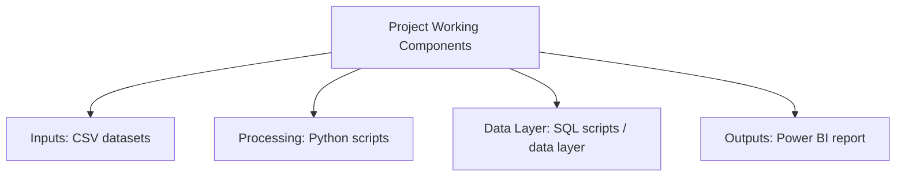

# Marketing Intelligence & Campaign Analytics

   

---

## Project Overview

This project analyzes marketing campaign data to compare campaign and customer response patterns. It brings the main marketing measures together so campaign performance is easier to review and compare.

## How the Project Works

The repository verifies these working components. A sequence is intentionally not invented where the project documentation does not prove one.

## What This Project Does

- Compares marketing campaign performance using the available campaign data.
- Reviews customer response and marketing measures in one analysis.
- Presents campaign results in clear visual views when dashboard files are available.

## Technologies Used

| Technology | How It Is Used |
|------------|----------------|
| Python | Cleans, prepares, and analyzes the project data |
| SQL | Queries and summarizes data for analysis |
| Power BI | Builds the interactive dashboard and visual analysis |
| CSV | Provides tabular source or output data for the analysis |

## Project Application

Campaign analytics can help marketing teams compare campaign response and performance. It can support decisions about which campaigns, customer groups, or channels deserve more attention.

---

[<- Return to Sales & Marketing Analytics Portfolio](https://github.com/gawandeshil03-ops/sales-marketing-analytics-portfolio)