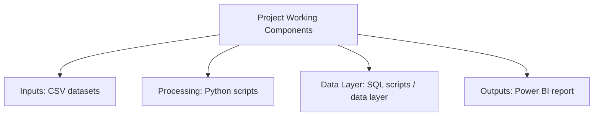

# Marketing Intelligence & Campaign Analytics

   

---

## Project Overview

This project focuses on Marketing Intelligence & Campaign Analytics and presents the analysis in a clear, practical way.

This project focuses on sales and marketing analytics. It is presented in a simple way so the main analysis and output are easy to understand.

## How the Project Works

The repository verifies these working components. A sequence is intentionally not invented where the project documentation does not prove one.

## What This Project Does

- Focuses on sales and marketing analytics.
- Uses the technologies shown below to complete the analysis or build the project output.
- Organizes the project work around a clear analytics problem.

## Technologies Used

| Technology | How It Is Used |
|------------|----------------|
| Python | Used in the project |
| SQL | Used in the project |
| Power BI | Used in the project |
| CSV | Used in the project |

## Project Application

This project shows how sales and marketing analytics can be approached with data and analytics. It can be useful for understanding the problem, comparing important information, and supporting better decisions.

---

[<- Return to Sales & Marketing Analytics Portfolio](https://github.com/gawandeshil03-ops/sales-marketing-analytics-portfolio)