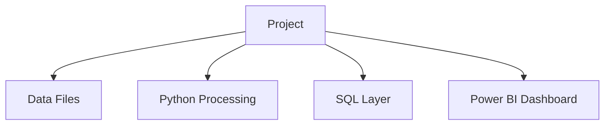

# Marketing Intelligence & Campaign Analytics

### A portfolio-ready repository for Marketing Intelligence & Campaign Analytics, documented from the files and technologies present in the project.

   

## Project Overview

A portfolio-ready repository for Marketing Intelligence & Campaign Analytics, documented from the files and technologies present in the project.

## Problem / Objective

Sales and marketing analytics.

## Project Component Map

This is intentionally a component map, not an invented workflow. The project files verify these components, but do not provide enough evidence to infer their execution order safely.

## Technology Stack

| Technology | Evidence / Purpose |
|------------|--------------------|
| Python | Verified from project files |
| SQL | Verified from project files |
| Power BI | Verified from project files |
| CSV | Verified from project files |

## Project Structure

`	ext
p-1074616477/
  - docs/
  - Project-_Marketing-Analysis-with-dashboard_Python_Sql_power-BI/
`

## Methodology

This recruiter-facing documentation was generated from files and technologies actually present in the project. Unsupported technologies, business results, deployment claims, and performance metrics are intentionally omitted.

## Suggested Enhancements

Potential future improvements may include stronger automated testing, packaging, deployment, monitoring, or additional documentation where appropriate to the actual project.

## Contact

- GitHub: https://github.com/gawandeshil03-ops
- LinkedIn: https://www.linkedin.com/in/shilgawande2004
- Email: gawandeshil9@gmail.com

[<- Return to Sales  Marketing Analytics Portfolio](https://github.com/gawandeshil03-ops/sales-marketing-analytics-portfolio)