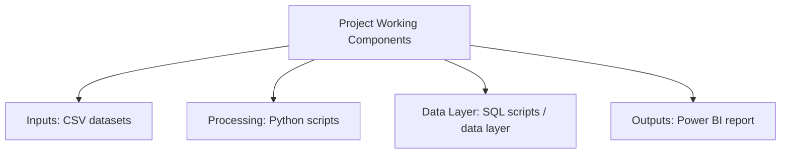

# Marketing Intelligence & Campaign Analytics

### A portfolio-ready repository for Marketing Intelligence & Campaign Analytics, documented from the files and technologies present in the project.

   

---

## Project Overview

A portfolio-ready repository for Marketing Intelligence & Campaign Analytics, documented from the files and technologies present in the project.

## Problem / Objective

**Application:** Sales and marketing analytics.

This README is generated from the actual project folder. Technologies, components, inputs, outputs, and architecture claims are included only when supported by repository evidence.

## Project Working Component Map

The repository verifies these working components. A sequence is intentionally not invented where the project documentation does not prove one.

## Verified Working Components

| Layer / Area | Verified Evidence |
|--------------|-------------------|
| Inputs | CSV datasets |
| Processing | Python scripts |
| Data / Storage | SQL scripts / data layer |
| Outputs / Interface | Power BI report |

## Technology Stack

| Technology | Evidence |
|------------|----------|
| Python | Verified from project files |
| SQL | Verified from project files |
| Power BI | Verified from project files |
| CSV | Verified from project files |

## Core Repository Files

| File | Type |
|------|------|
| `Project-_Marketing-Analysis-with-dashboard_Python_Sql_power-BI\Calendar DAX Script.txt` | TXT |
| `Project-_Marketing-Analysis-with-dashboard_Python_Sql_power-BI\customer_reviews_enrichment.py` | PY |
| `Project-_Marketing-Analysis-with-dashboard_Python_Sql_power-BI\Dashboard.pbix` | PBIX |
| `Project-_Marketing-Analysis-with-dashboard_Python_Sql_power-BI\dim_customers.sql` | SQL |
| `Project-_Marketing-Analysis-with-dashboard_Python_Sql_power-BI\dim_products.sql` | SQL |
| `Project-_Marketing-Analysis-with-dashboard_Python_Sql_power-BI\fact_customer_journey.sql` | SQL |
| `Project-_Marketing-Analysis-with-dashboard_Python_Sql_power-BI\fact_customer_reviews.sql` | SQL |
| `Project-_Marketing-Analysis-with-dashboard_Python_Sql_power-BI\fact_customer_reviews_enrich.csv` | CSV |
| `Project-_Marketing-Analysis-with-dashboard_Python_Sql_power-BI\fact_engagement_data.sql` | SQL |

## Project Structure

`	ext
p-1074616477/
  - docs/
  - Project-_Marketing-Analysis-with-dashboard_Python_Sql_power-BI/
`

## How the Project Is Organized

The architecture/workflow visual above is the primary working view of this project. When an existing architecture or workflow image is present, that project asset is used directly. Otherwise, the automation derives a Mermaid visual only from verified project documentation and artifacts.

## Methodology & Documentation Policy

- Local project files are the source of truth.
- Existing project README content is preserved under `docs/ORIGINAL_README.md` in the safe publication copy when available.
- Technology badges are created only from detected project evidence.
- Unsupported databases, cloud services, APIs, models, metrics, deployment claims, users, clients, revenue, savings, or business outcomes are omitted.
- When workflow order cannot be proven, the visual is explicitly shown as a working component map rather than a fabricated sequence.

## Explore

Use the repository files together with the architecture/workflow visual, technology table, and project structure above to understand the implementation.

## Contact

- GitHub: https://github.com/gawandeshil03-ops
- LinkedIn: https://www.linkedin.com/in/shilgawande2004
- Email: gawandeshil9@gmail.com

---

[<- Return to Sales  Marketing Analytics Portfolio](https://github.com/gawandeshil03-ops/sales-marketing-analytics-portfolio)